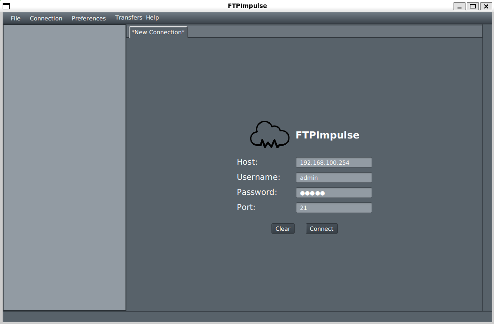

# JavaFX FTP Client

A **Java desktop FTP client** with a graphical user interface (GUI) built using **JavaFX**. This application allows users to connect to FTP servers, browse directories, upload and download files, and manage remote files with ease.

---

## Features

- Connect to any FTP server using credentials (host, port, username, password)
- Handle **multiple FTP connections simultaneously**
- Browse remote directories with an **interactive UI** using a **TreeView** for directories and a **TableView** for files
- Upload and download files between local and remote systems
- **Transfer list window** showing all ongoing and completed transfers
- **Logging of FTP protocol communication** for debugging and monitoring
- **Dark mode** support for comfortable viewing

---

## Screenshots




---

## Requirements

- Java 11 or higher
- JavaFX SDK
- Apache Commons Net (for FTP functionality) or another FTP library

---

## Installation

1. Clone the repository:
   ```bash
   git clone https://github.com/regular-anon/FileTransfer-FTP.git
